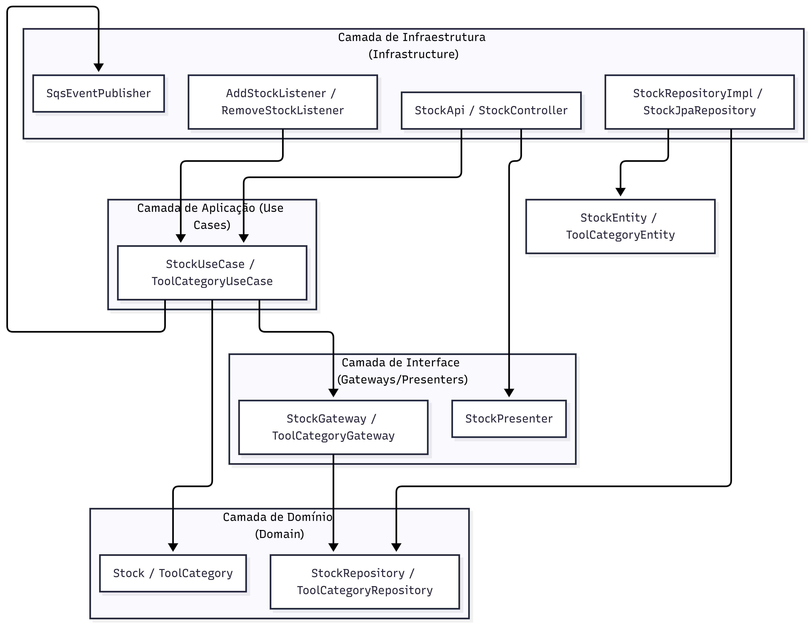
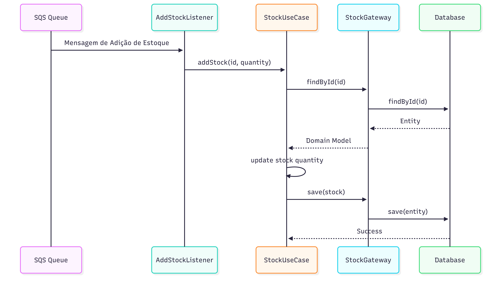
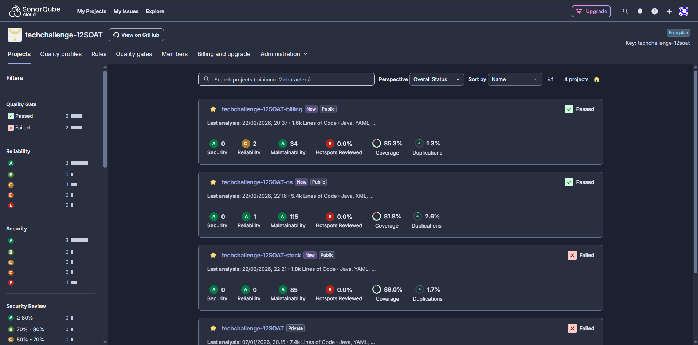
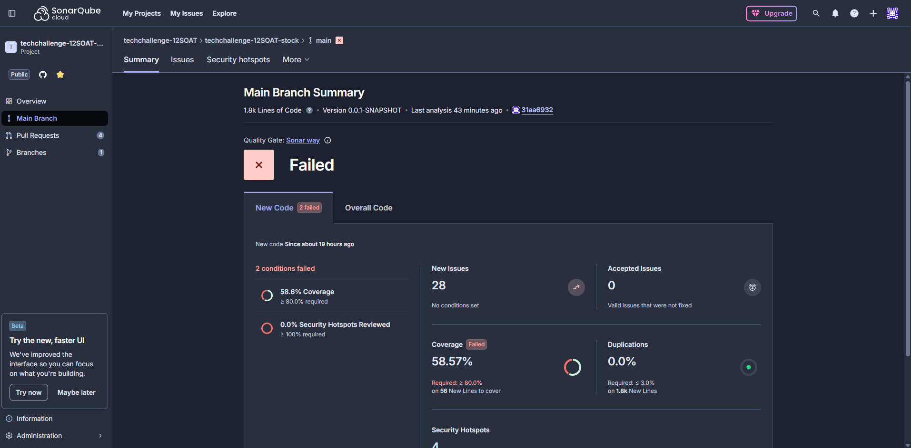

# POS TECH - Tech Challenge: Microsserviço de Estoque

Este repositório contém o código-fonte e os manifestos de deploy do **Microsserviço de Estoque**, parte integrante do **Sistema Integrado de Atendimento e Execução de Serviços** de uma oficina mecânica. O projeto foi desenvolvido como parte do "Tech Challenge" da pós-graduação POS TECH, com o objetivo de solucionar os desafios de gestão de peças e controle de disponibilidade.

O sistema foi modelado utilizando a metodologia **Clean Architecture**, garantindo desacoplamento e facilidade de manutenção. A aplicação é um microsserviço desenvolvido em **Java 21** e **Spring Boot 3**, expondo suas funcionalidades através de APIs **RESTful** e integrando-se assincronamente via mensageria.

O foco deste repositório é a lógica de negócio do domínio de Estoque, incluindo a gestão de categorias de ferramentas, controle de entrada e saída de itens e validação de disponibilidade para ordens de serviço.

### Tecnologias e Recursos da AWS

*   **Java 21 & Spring Boot:** Base da aplicação.
*   **PostgreSQL:** Banco de dados relacional gerido via **Liquibase**.
*   **AWS SQS:** Mensageria para comunicação assíncrona (filas de adição/remoção de estoque e atualização de status).
*   **AWS Secrets Manager:** Gerenciamento seguro de credenciais de banco de dados.
*   **AWS ECR:** Armazenamento da imagem Docker da aplicação.
*   **Kubernetes (EKS):** Orquestração dos containers da aplicação (Deployment, Service, HPA).

### Swagger
A documentação da API do microsserviço de estoque está disponível via Swagger, permitindo fácil visualização e teste dos endpoints. Para acessar a documentação:

http://localhost:8080/swagger-ui/index.html

### Arquitetura

#### Diagrama de camadas

#### Diagrama de sequência

### Evidência do SonarCloud funcionando

